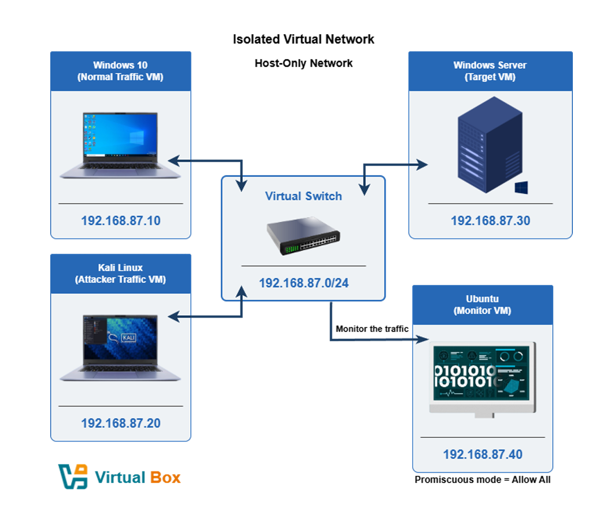
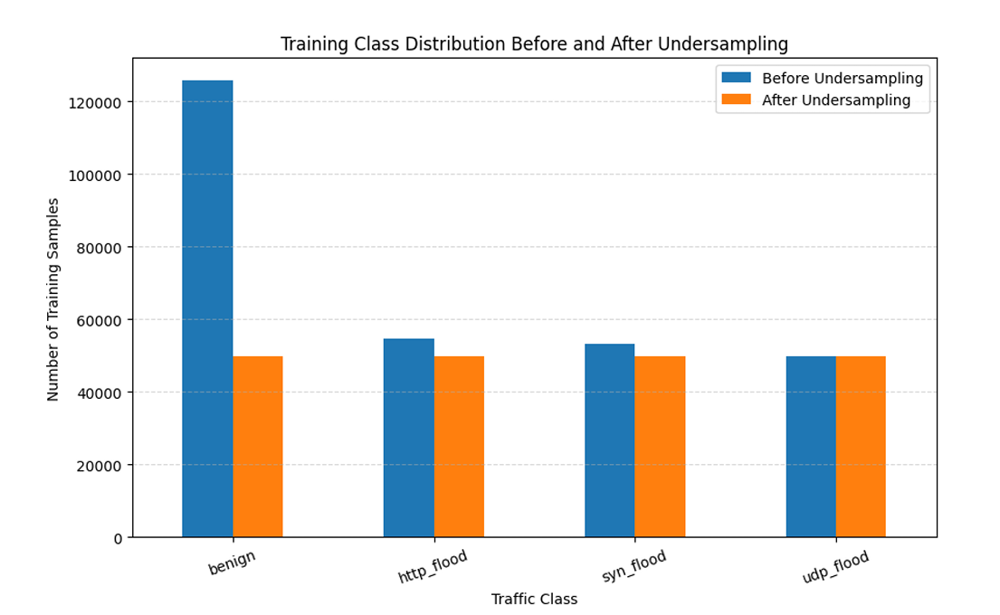
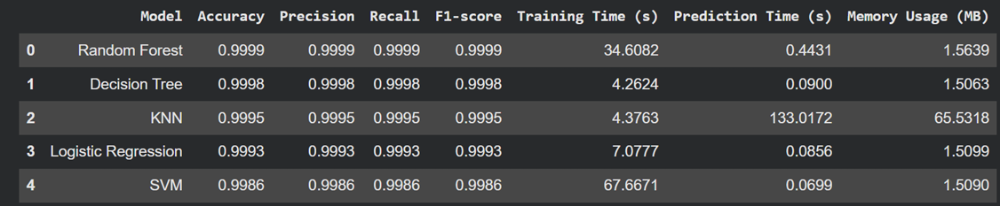
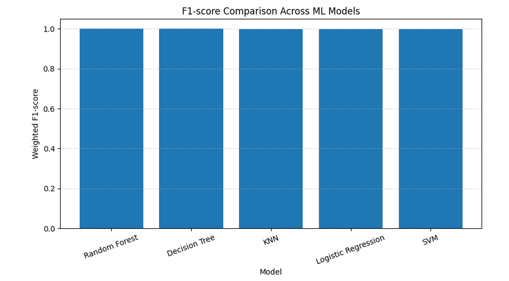
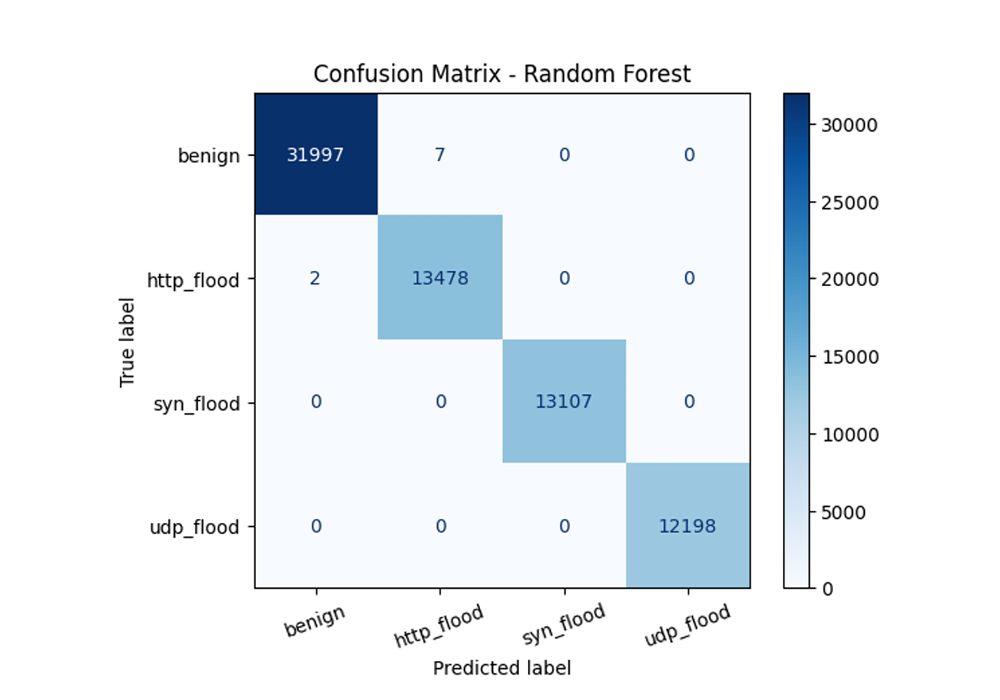
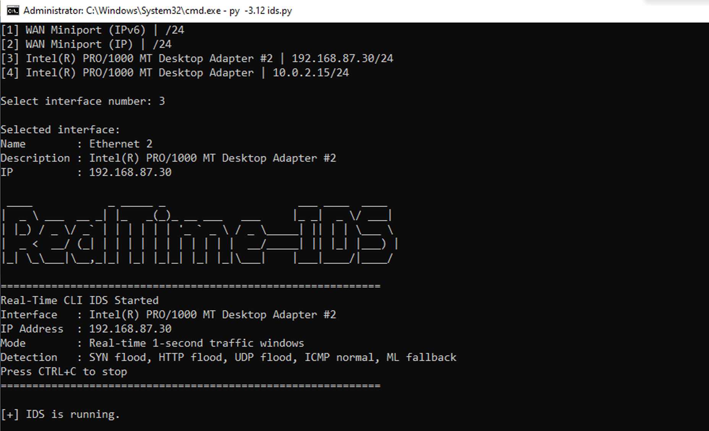
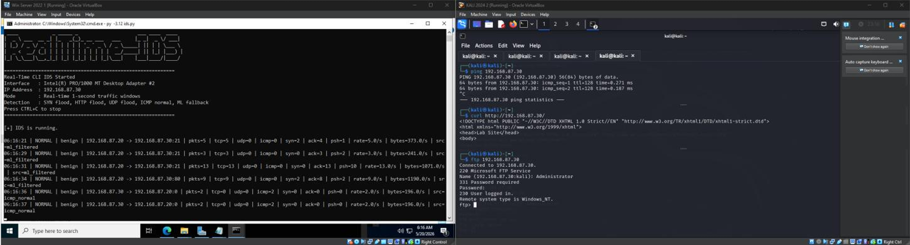
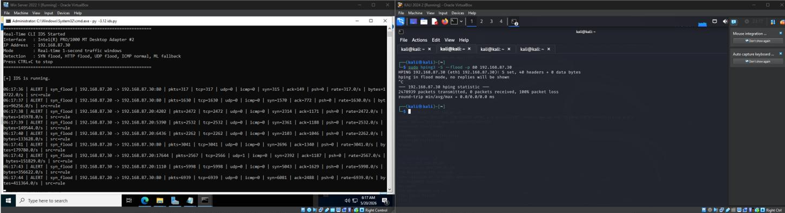
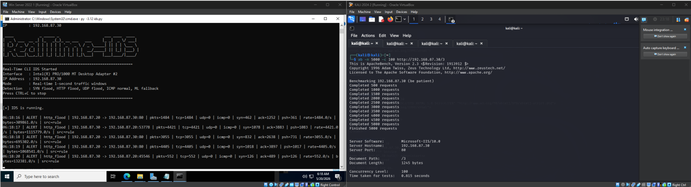
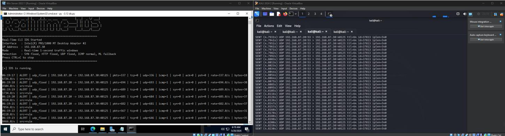

# 🛡️ Machine Learning-Based Network Intrusion Detection System for Smart City Infrastructure

**A supervised machine learning pipeline and real-time detection tool for identifying and classifying DDoS attacks — SYN Flood, HTTP Flood, and UDP Flood — in a simulated smart city network environment.**

     

---

## 📋 Overview

This project demonstrates the end-to-end design and implementation of a **Network Intrusion Detection System (NIDS)** for a simulated smart city network, combining machine learning-based traffic classification with real-time detection.

A fully isolated virtual lab was built to generate realistic benign and attack traffic, extract statistical flow features from that traffic, and train multiple classifiers to distinguish **benign traffic** from three common denial-of-service attack types: **SYN Flood, HTTP Flood, and UDP Flood**. The best-performing model was then deployed into a live CLI intrusion detection tool that monitors traffic in real time and raises alerts as attacks occur.

**Why this matters:** Smart city infrastructure (traffic systems, utilities, public sensor networks) is increasingly connected and increasingly targeted. DDoS attacks against this infrastructure can degrade or disable public services. This project simulates the traffic analysis and detection tooling a Security Operations Center (SOC) would rely on to catch these attacks as they happen, rather than after the fact.

---

## 🏙️ Environment Profile

| Item | Description |
|---|---|
| **Simulated Environment** | Smart City Network (isolated VirtualBox lab) |
| **Attack Types Detected** | SYN Flood, HTTP Flood, UDP Flood |
| **Detection Approach** | Rule-based thresholds + ML classification fallback |
| **Best Model** | Random Forest (99.99% Accuracy / F1-score) |
| **Focus Areas** | Traffic Capture, Feature Engineering, ML Classification, Real-Time Detection |

---

## 🧰 Technologies & Concepts Used

| Category | Details |
|---|---|
| **Virtualization** | Oracle VirtualBox, host-only isolated network |
| **Traffic Capture & Features** | CICFlowMeter (flow-based feature extraction) |
| **Machine Learning** | Scikit-learn — KNN, Logistic Regression, Decision Tree, Random Forest, SVM |
| **Data Preparation** | Feature selection, normalization, label encoding, Random Undersampling |
| **Attack Simulation** | hping3 (SYN flood), ApacheBench (HTTP flood), UDP flood generator |
| **Real-Time Detection** | Custom Python CLI IDS with 1-second traffic windows |

---

## 🏗️ Lab Architecture

```
                Isolated Virtual Network (192.168.87.0/24)
                         Host-Only Network

   Windows 10                                    Windows Server
(Normal Traffic VM) ──┐                    ┌──►  (Target VM)
  192.168.87.10        │                    │      192.168.87.30
                        ▼                    │
                  Virtual Switch ────────────┘
                  192.168.87.0/24
                        ▲                    │
   Kali Linux           │                    │ Monitors the traffic
(Attacker Traffic VM) ──┘                    ▼
  192.168.87.20                          Ubuntu (Monitor VM)
                                       192.168.87.40
                                Promiscuous mode = Allow All
```

Four VMs sit behind a virtual switch on an isolated host-only network: a normal-traffic generator, an attacker VM, the target server, and a monitor VM running in promiscuous mode to passively capture all traffic for both dataset generation and live inference.



---

## 📌 Implementation Walkthrough

### 1. Lab Setup & Traffic Generation

The lab was built with four roles: a **Windows 10** VM generating normal traffic (ping, curl, FTP), a **Kali Linux** VM generating attack traffic, a **Windows Server 2022** target running IIS/FTP services, and an **Ubuntu** VM passively monitoring all traffic in promiscuous mode.

Attacks were generated using industry-standard tooling:
- **SYN Flood** — `hping3 -S --flood -p 80 <target>`
- **HTTP Flood** — ApacheBench (`ab -n 5000 -c 100 <target>`)
- **UDP Flood** — high-rate UDP packet generator

---

### 2. Data Preparation

Raw captured traffic was converted into labeled network flow records using **CICFlowMeter**, producing dozens of statistical features per flow (packet counts, byte counts, inter-arrival times, TCP flag counts, flow duration).

The raw dataset was heavily imbalanced toward benign traffic. **Random Undersampling** was applied to bring every class down to the minority class size before training, preventing the models from trivially favoring the majority class.



---

### 3. Model Training & Benchmarking

Five classification algorithms were trained and benchmarked on the balanced dataset: **K-Nearest Neighbors, Logistic Regression, Decision Tree, Random Forest, and SVM**. Each model was evaluated on Accuracy, Precision, Recall, F1-score, training time, prediction time, and memory usage.





**Random Forest** was selected as the best-performing and most deployable model — it topped every accuracy metric while keeping prediction latency (0.44s) and memory usage (1.56 MB) low enough for real-time inference. KNN was competitive on accuracy but impractical for deployment, with a ~133-second prediction time and 65 MB memory footprint per batch.

---

### 4. Model Evaluation

The confusion matrix for the Random Forest model shows near-perfect separation between all four traffic classes, with only 9 misclassifications out of 70,789 test samples — all between `benign` and `http_flood`, which is expected since HTTP floods use legitimate-looking application-layer requests.



---

### 5. Real-Time Intrusion Detection

The trained Random Forest model was deployed into a custom **Real-Time CLI IDS**, which sniffs live traffic on a monitored interface, aggregates it into 1-second windows, applies rule-based thresholds for obvious flood signatures, and falls back to the ML model for ambiguous traffic.

**IDS startup and interface selection:**



**Benign traffic correctly classified as normal (ping, curl, FTP):**



**SYN Flood detected in real time (`hping3 -S --flood`):**



**HTTP Flood detected in real time (ApacheBench):**



**UDP Flood detected in real time:**



---

## ✅ Key Results

| Capability | Status |
|---|---|
| Isolated Attack Range Setup | ✅ |
| Benign & Attack Traffic Generation | ✅ |
| Flow-Based Feature Extraction (CICFlowMeter) | ✅ |
| Class Imbalance Handling (Undersampling) | ✅ |
| Multi-Model Training & Benchmarking | ✅ |
| Confusion Matrix & Metric Evaluation | ✅ |
| Best Model Selection (Random Forest) | ✅ |
| Real-Time Rule-Based Detection | ✅ |
| Real-Time ML Fallback Classification | ✅ |
| Live Alerting via CLI | ✅ |

### Final Model Performance (Random Forest)

| Metric | Score |
|---|---|
| Accuracy | 99.99% |
| Precision | 99.99% |
| Recall | 99.99% |
| F1-score | 99.99% |
| Prediction Time | 0.44s |
| Memory Usage | 1.56 MB |

---

## 🎯 Skills Demonstrated

- **Network Traffic Analysis** — flow-based feature extraction, protocol-level packet analysis
- **Intrusion Detection** — rule-based signature detection, hybrid rule/ML detection architecture
- **Machine Learning** — supervised classification, model benchmarking, hyperparameter awareness, cross-validation
- **Data Preprocessing** — feature scaling, label encoding, class imbalance correction
- **Threat Simulation** — DDoS attack generation (SYN/HTTP/UDP flood) in a controlled lab
- **Security Tooling** — real-time detection system design for SOC-style monitoring

---

## 📂 Repository Structure

```
ml-nids-smart-city/
│
├── README.md
├── LICENSE
│
└── images/
    ├── network-architecture.png
    ├── class-distribution.png
    ├── model-comparison-table.png
    ├── f1-score-comparison.png
    ├── confusion-matrix-random-forest.png
    ├── ids-startup.png
    ├── benign-traffic-detection.png
    ├── syn-flood-detection.png
    ├── http-flood-detection.png
    └── udp-flood-detection.png
```

---

## 📄 License

This project is shared under the [MIT License](LICENSE) — feel free to reference the structure and approach for your own network security learning projects.

## 👤 Author

**Ali Alaradi** — [github.com/0xcgz](https://github.com/0xcgz)
